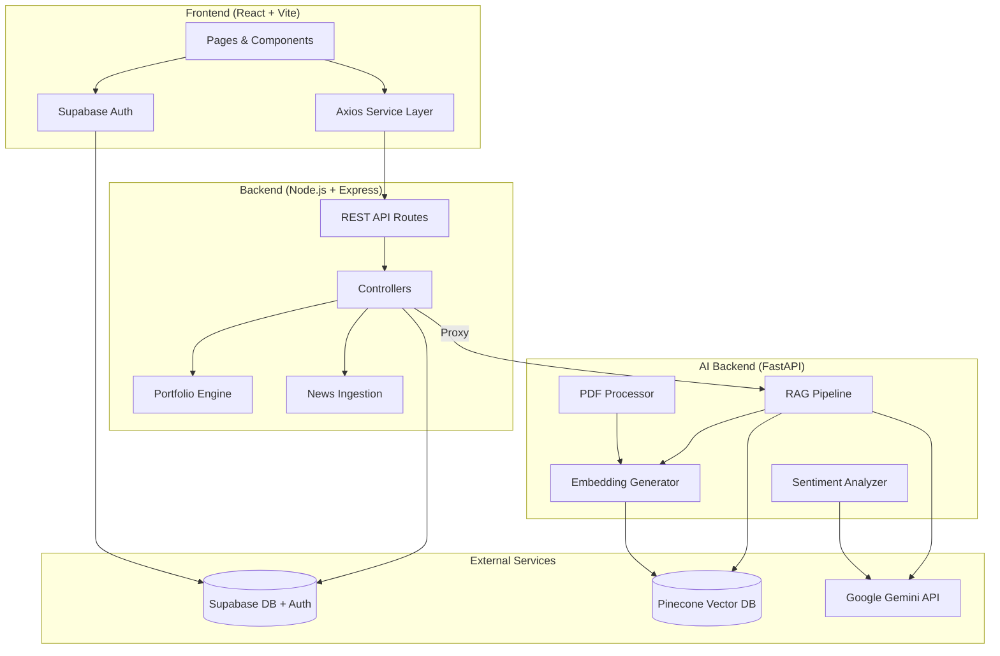

# SMART FINANCE SOLUTIONS — Implementation Plan

Build an AI-powered financial intelligence platform with three services: React frontend, Node.js backend, and Python FastAPI AI backend.

---

## User Review Required

> [!IMPORTANT]
> **API Keys & Services Required**: This project requires active accounts and API keys for:
> - **Supabase** — Database, auth, and storage
> - **Pinecone** — Vector database (free tier available)
> - **Google Gemini API** — LLM for chat, summarization, sentiment
> - You'll need to provide these keys in `.env` files before running

> [!WARNING]
> **MCP Integrations**: The request mentions "Stitch MCP" and "Supabase MCP". Since these are external MCP server integrations that require separate runtime configuration, I will:
> - Build the **Supabase integration directly** using the `@supabase/supabase-js` SDK (standard approach)
> - Build the **UI manually** with premium fintech dark-theme design (rather than depending on Stitch MCP runtime)
> - The Supabase schema will be provided as SQL migrations you can run via Supabase Dashboard or CLI

> [!IMPORTANT]
> **Pinecone Dimension**: The request specifies dimension 1536, but Google's Gemini embedding model (`text-embedding-004`) produces 768-dimensional vectors. I will use **768 dimensions** to match Gemini embeddings. If you want 1536 (OpenAI-compatible), please confirm and I'll adjust.

---

## Proposed Changes

### 1. Project Root

#### [NEW] README.md
Full setup instructions covering all three services, environment variables, database setup, and deployment.

#### [NEW] .env.example
Template for all environment variables across services.

---

### 2. Frontend (`/frontend`) — React + Vite + Tailwind

#### [NEW] Package & Config Files
- `package.json` — React 18, Vite, Tailwind CSS, Recharts, Axios, `@supabase/supabase-js`, React Router
- `vite.config.js`, `tailwind.config.js`, `postcss.config.js`
- `index.html`
- `.env.example`

#### [NEW] Design System (`src/index.css`)
Premium fintech dark theme with:
- Dark navy/slate backgrounds (`#0a0e1a`, `#111827`)
- Accent gradients (teal → cyan → blue)
- Glassmorphism card effects
- Google Fonts (Inter)
- Smooth transitions and micro-animations

#### [NEW] Auth & Services (`src/services/`)
- `supabaseClient.js` — Supabase client initialization
- `api.js` — Axios instance with base URL and auth interceptor
- `authService.js` — Login, signup, logout, session management
- `portfolioService.js` — Portfolio CRUD and generation
- `chatService.js` — AI chat communication
- `researchService.js` — PDF upload and document management
- `newsService.js` — Financial news fetching

#### [NEW] Hooks (`src/hooks/`)
- `useAuth.js` — Auth state management hook
- `usePortfolio.js` — Portfolio data hook

#### [NEW] Components (`src/components/`)
- `Layout.jsx` — Main app layout with sidebar navigation
- `ProtectedRoute.jsx` — Auth-guarded route wrapper
- `Sidebar.jsx` — Navigation sidebar with icons
- `RiskGauge.jsx` — Animated risk score gauge (Recharts)
- `PortfolioPieChart.jsx` — Allocation pie chart
- `SentimentBarChart.jsx` — Sector sentiment visualization
- `NewsFeed.jsx` — Recent financial news panel
- `ChatWidget.jsx` — Chat assistant sidebar component

#### [NEW] Pages (`src/pages/`)
- `Login.jsx` — Email/password login with dark fintech theme
- `Signup.jsx` — Registration with risk profile selection
- `Dashboard.jsx` — Main dashboard with 4 widget panels
- `Portfolio.jsx` — Portfolio generator form + results
- `Chat.jsx` — Full-page AI chat with RAG
- `Research.jsx` — PDF upload + document list + summaries

#### [NEW] Utils (`src/utils/`)
- `formatters.js` — Currency, percentage, date formatters

#### [NEW] App Entry (`src/`)
- `App.jsx` — Router setup with protected routes
- `main.jsx` — React root + Supabase provider

---

### 3. Node.js Backend (`/backend`)

#### [NEW] Package & Config
- `package.json` — Express, `@supabase/supabase-js`, axios, cors, dotenv, multer
- `.env.example`
- `server.js` — Express app entry point

#### [NEW] Config (`config/`)
- `supabase.js` — Supabase admin client
- `constants.js` — App constants

#### [NEW] Middleware (`middleware/`)
- `auth.js` — JWT verification via Supabase
- `errorHandler.js` — Global error handling

#### [NEW] Routes (`routes/`)
- `authRoutes.js` — POST `/auth/login`, `/auth/signup`, `/auth/logout`
- `portfolioRoutes.js` — POST `/portfolio/generate`, GET `/portfolio/:userId`
- `newsRoutes.js` — GET `/news`, POST `/news/ingest`
- `researchRoutes.js` — POST `/research/upload`, GET `/research`
- `chatRoutes.js` — POST `/chat`

#### [NEW] Controllers (`controllers/`)
- `authController.js` — Auth logic delegation to Supabase
- `portfolioController.js` — Portfolio generation + storage
- `newsController.js` — News fetch + sentiment pipeline
- `researchController.js` — PDF upload + embedding trigger
- `chatController.js` — Chat proxy to AI backend

#### [NEW] Services (`services/`)
- `portfolioEngine.js` — Portfolio allocation algorithm based on risk level, amount, duration
- `newsIngestion.js` — Finance news fetching and storage
- `aiClient.js` — Axios client for AI backend communication

---

### 4. Python AI Backend (`/ai-backend`)

#### [NEW] Package & Config
- `requirements.txt` — FastAPI, uvicorn, pinecone-client, google-generativeai, PyPDF2, python-multipart, pydantic
- `.env.example`
- `main.py` — FastAPI app with CORS and route registration

#### [NEW] Routes (`routes/`)
- `embed_routes.py` — POST `/embed`, POST `/store-vector`
- `chat_routes.py` — POST `/chat`, POST `/query-context`
- `pdf_routes.py` — POST `/summarize-pdf`
- `sentiment_routes.py` — POST `/analyze-sentiment`

#### [NEW] Services (`services/`)
- `gemini_service.py` — Gemini API wrapper for chat, summarization, sentiment
- `pinecone_service.py` — Pinecone client, upsert, query operations
- `embedding_service.py` — Text embedding generation via Gemini

#### [NEW] RAG Pipeline (`rag/`)
- `pipeline.py` — Full RAG flow: embed query → search Pinecone → build context → Gemini response
- `context_builder.py` — Context assembly from retrieved vectors

#### [NEW] Embeddings (`embeddings/`)
- `generator.py` — Chunk text and generate embeddings

#### [NEW] PDF Processing (`pdf_processing/`)
- `extractor.py` — PDF text extraction using PyPDF2
- `chunker.py` — Text chunking for embedding

---

### 5. Supabase Schema (SQL Migrations)

#### [NEW] `supabase/migrations/001_create_tables.sql`
```sql
-- users table
CREATE TABLE users (
  id UUID PRIMARY KEY DEFAULT gen_random_uuid(),
  email TEXT UNIQUE NOT NULL,
  risk_profile TEXT DEFAULT 'moderate',
  investment_goal TEXT,
  created_at TIMESTAMPTZ DEFAULT now()
);

-- portfolios table  
CREATE TABLE portfolios (
  id UUID PRIMARY KEY DEFAULT gen_random_uuid(),
  user_id UUID REFERENCES users(id),
  allocation_json JSONB NOT NULL,
  risk_score NUMERIC,
  created_at TIMESTAMPTZ DEFAULT now()
);

-- research_documents table
CREATE TABLE research_documents (
  id UUID PRIMARY KEY DEFAULT gen_random_uuid(),
  title TEXT NOT NULL,
  file_url TEXT,
  embedding_status TEXT DEFAULT 'pending',
  uploaded_by UUID REFERENCES users(id),
  created_at TIMESTAMPTZ DEFAULT now()
);

-- financial_news table
CREATE TABLE financial_news (
  id UUID PRIMARY KEY DEFAULT gen_random_uuid(),
  title TEXT NOT NULL,
  content TEXT,
  sentiment TEXT,
  source TEXT,
  created_at TIMESTAMPTZ DEFAULT now()
);

-- chat_history table
CREATE TABLE chat_history (
  id UUID PRIMARY KEY DEFAULT gen_random_uuid(),
  user_id UUID REFERENCES users(id),
  question TEXT NOT NULL,
  response TEXT NOT NULL,
  created_at TIMESTAMPTZ DEFAULT now()
);
```

Enable Row Level Security (RLS) policies for all tables.

---

## Architecture Diagram



---

## Open Questions

> [!IMPORTANT]
> 1. **Pinecone dimensions**: Should I use **768** (Gemini embedding native) or **1536** (OpenAI-compatible)? Using 768 is recommended for Gemini.

> [!IMPORTANT]
> 2. **Finance news source**: Should the news ingestion use a free API (e.g., NewsAPI, Alpha Vantage) or mock data for development? I'll default to **mock data + a pluggable adapter** for real APIs.

> [!IMPORTANT]
> 3. **Project location**: I'll create the project at `c:\Users\krish\OneDrive\Desktop\Attentify\smart-finance-solutions\`. Is this path acceptable, or do you want it directly in the Attentify root?

---

## Verification Plan

### Automated Tests
1. `npm run build` on frontend — verifies React compiles without errors
2. `node server.js` on backend — verifies Express starts and routes register
3. `uvicorn main:app` on ai-backend — verifies FastAPI starts
4. Browser visual check — login, dashboard, chat pages render correctly

### Manual Verification
- Run all three services locally
- Test auth flow (signup → login → dashboard)
- Test portfolio generation
- Test PDF upload → summary
- Test chat with RAG pipeline
- Verify Supabase tables via dashboard
